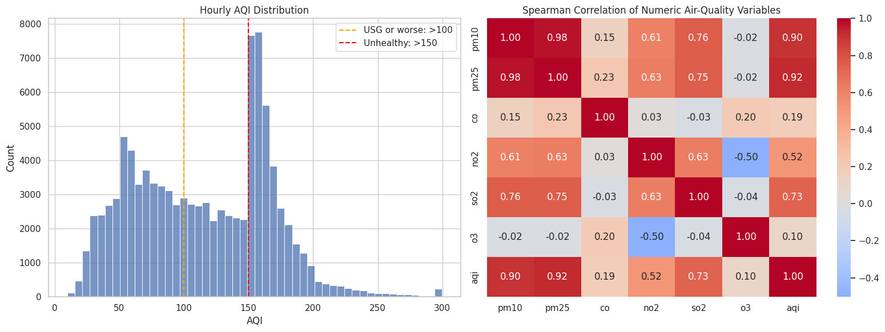
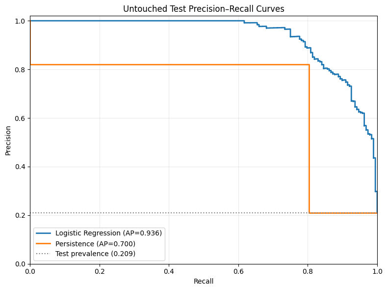
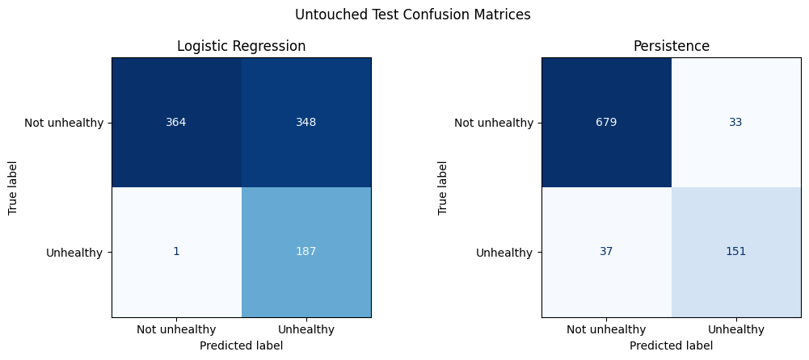

# Next-Day Unhealthy Air Quality Classification

**Course:** CSE437 Data Science  
**Section:** [Add section]  
**Semester:** [Add semester]  
**Group:** 18  
**Group members:** Araf Ul Haque ([Add student ID]); S M Arham Ali ([Add student ID])  
**GitHub repository:** <https://github.com/ArafUlHaque/cse437-air-quality-group-18>  
**Date:** 3 September 2026

## Summary

This project used Version 2 of the Bangladesh Air Quality Index dataset to predict whether the next calendar day's maximum supplied hourly AQI would exceed 150. The binary target was constructed for five cities using only information available through the preceding day. After auditing 1,048,551 hourly rows, the data were restricted to a complete common period, aggregated daily, and converted into 65 strictly lagged predictors. Logistic Regression, Random Forest, and Histogram Gradient Boosting were compared with a persistence baseline using chronological validation. Average precision and recall were fixed as the primary metrics because missing an unhealthy day was more costly than issuing an extra warning. The final balanced Logistic Regression model and its F2-selected threshold were frozen before the test labels were accessed. On 900 untouched test rows, the model achieved average precision 0.9359 and recall 0.9947, compared with 0.7003 and 0.8032 for persistence. The most important finding is that machine learning beat persistence on both primary metrics in all five cities, reducing false negatives from 37 to 1, although this required accepting 348 false positives and substantially lower precision.

## 1. Problem and Dataset

### 1.1 Problem statement

The task is to predict whether a selected Bangladeshi city's next calendar day will have unhealthy air, using only measurements available by the end of the current day. An advance warning can support planning and risk communication, while a same-day reconstruction of AQI would not provide a genuine forecast. The prediction is therefore aligned exactly from feature day `t` to target day `t+1`.

This is a recall-oriented classification problem. A false negative means that an actually unhealthy day receives no warning, whereas a false positive means that a warning is issued for a day that remains at or below the unhealthy threshold. The project prioritizes avoiding false negatives but reports the false-positive cost transparently.

### 1.2 Dataset

The project uses the *Bangladesh Air Quality Index (AQI) Dataset (2000-2025): Historical Hourly Air Pollution Data Across 103 Cities*, Version 2, published by Tapon Paul on Mendeley Data [1]. The downloaded files were `AQI Bangladesh.csv` and `cities.csv`. No web scraping was performed. The metadata file was used to audit city names and coordinates; it was not merged into the modeling predictors.

The main file contains 1,048,551 rows and 13 source columns: city identifier, city name, latitude, longitude, timestamp, PM10, PM2.5, carbon monoxide, carbon dioxide, nitrogen dioxide, sulphur dioxide, ozone, and supplied AQI. Its recorded timestamps span 1 January 2000 to 23 November 2025. The dataset is licensed under CC BY 4.0. The main-file SHA-256 checksum is `8760175fc048eea4180b828fd60d10cb799a73a5144a7e4aca19ddbaf8dbdd62`.

Although the published metadata lists 103 cities, only 30 appear in the main AQI file. The file ends only 24 data rows below Excel's worksheet limit, and the final city's block is incomplete. This is strong evidence that the distributed CSV is an Excel-truncated export. The analysis therefore uses five cities with complete overlapping coverage - Dhaka, Dinājpur, Bherāmāra, Bhola, and Cox’s Bāzār - over 5 August 2022 to 23 November 2025.

### 1.3 Target variable

`next_day_unhealthy` is a binary variable. It equals 1 when the next calendar day's daily maximum supplied AQI is greater than 150 (integer AQI 151 or above), and 0 otherwise. Daily AQI is operationally defined as the maximum supplied hourly AQI for a city-date with at least 18 valid AQI hours. The project does not claim to independently calculate an official regulatory daily AQI.

After the seven days of history required for feature construction were removed from each city, the modeling dataset contained 6,000 rows. There were 2,399 positives (39.98%) and 3,601 negatives (60.02%).

| City | Modeling rows | Positive days | Positive rate |
| --- | ---: | ---: | ---: |
| Dhaka | 1,200 | 563 | 46.92% |
| Dinājpur | 1,200 | 540 | 45.00% |
| Bherāmāra | 1,200 | 660 | 55.00% |
| Bhola | 1,200 | 339 | 28.25% |
| Cox’s Bāzār | 1,200 | 297 | 24.75% |
| **Overall** | **6,000** | **2,399** | **39.98%** |

A separate binary variable, `next_day_usg_or_worse`, marks next-day AQI greater than 100. It contains 3,703 positives (61.72%) but was not used for main-model selection.

### 1.4 Three questions

1. How well does a model trained on Dhaka transfer to smaller Bangladeshi cities with comparable temporal coverage?
2. Can machine-learning models outperform a persistence baseline for next-day unhealthy-air prediction?
3. Which strictly lagged pollutant measurements and historical windows are most useful for predicting next-day unhealthy air quality?

## 2. Data Handling and Preprocessing

### 2.1 Data quality audit

The raw audit found no missing city names, unparseable timestamps, numeric parsing failures, exact duplicate rows, or duplicate city-timestamp pairs. Every audited city series had a median one-hour interval and no gap longer than 1.5 hours. However, only 30 of the 103 metadata cities appeared in the main file, 73 were absent, and the final city block was incomplete.

Missingness was concentrated in two variables. Carbon dioxide had 774,327 missing values (73.85%), and AQI had 696 missing values (0.066%). The audit also detected one negative NO2 observation and eleven negative O3 observations. No AQI value was below 0 or above 500, and no coordinates fell outside the approximate Bangladesh bounds.

### 2.2 Missing values

The repeated city-level CO2 pattern was treated as systematic or structural missingness rather than assumed to be missing completely at random. CO2 was dropped entirely and never used as a predictor. Missing AQI was not imputed because doing so could manufacture the outcome; a daily AQI was accepted only when at least 18 hourly AQI values were present.

The one negative NO2 value and eleven negative O3 values were physically invalid and were changed to missing before aggregation. They occurred outside the five-city analytical scope, so the selected 144,840 hourly rows contained no missing pollutant or AQI values. Pollutant daily means and maxima used the available valid readings without imputation. A complete city-date calendar was created before target construction so that any missing dates would remain explicit; no calendar rows needed to be inserted in the selected scope.

### 2.3 Outliers

Outlier handling was rule-based, not based on arbitrary z-score or interquartile-range deletion. The audit flagged 12 impossible negative concentration records: one NO2 and eleven O3. These values were converted to missing, while the rows were retained. No selected AQI value violated the valid 0-500 range. High but physically possible pollution values were not clipped or removed because they may represent the important unhealthy events being predicted. In the selected hourly scope, observed ranges were AQI 12-275, PM10 0.3-451.7, PM2.5 0.2-314.8, CO 58-4,313, NO2 0-178, SO2 0-99.8, and O3 0-326.

### 2.4 Transformation and scaling

Timestamps were parsed using their recorded clock times because the source contains no timezone offset. The analysis retained the five locked cities and common dates, removed CO2 and static identifiers, and aggregated hourly observations to one row per city-date. Each pollutant contributed a daily mean, daily maximum, and valid-hour count. Daily AQI used the maximum supplied hourly AQI.

No categorical encoding was needed because city was an identifier and the final model was developed only on Dhaka. No log transform, power transform, or dimensionality-reduction transform was used. `StandardScaler` was included only inside the Logistic Regression pipeline. During cross-validation, each scaler was fitted on that fold's earlier training segment, never on its later validation segment. The final scaler and model were refitted on Dhaka train-plus-validation data only. Tree models did not require scaling.

### 2.5 Before and after

| Stage | Rows | Columns | Main change |
| --- | ---: | ---: | --- |
| Raw source | 1,048,551 | 13 | Untouched downloaded AQI file |
| Selected hourly working table | 144,840 | 11 | Five cities/common dates; identifiers and CO2 removed; date/hour added |
| Daily processed output | 6,035 | 24 | One row per city-date with aggregates and coverage counts |
| Model-ready output | 6,000 | 71 | Seven structural-history rows removed per city; identifiers, outcomes, and 65 predictors |
| Dhaka training features | 840 | 65 | Earliest chronological model-development segment |
| Dhaka validation features | 180 | 65 | Later model and threshold selection segment |
| All-city test features | 900 | 65 | Final untouched period, 180 rows per city |

Leakage was prevented by completing the calendar before shifting, constructing predictors only from day `t` or earlier, splitting by target date, fitting learned transformations inside training folds, selecting the model and threshold without test labels, and evaluating the frozen test set once.

## 3. Statistical Analysis

### 3.1 Descriptive statistics

Every selected city contributed 1,207 calendar days and exactly 24 hourly observations per day. The median, minimum, and maximum daily observed-hour counts were therefore all 24. This complete and constant coverage removed measurement-count variation as an explanation for later model errors.

The hourly AQI distribution was not symmetric. The reproducible 100,000-row audit sample showed a broad concentration from roughly 40 to 190, a strong mode around the unhealthy threshold region, and a thinner right tail toward 300. The wide pollutant ranges reported in Section 2.3 also supported using rank-based Spearman correlation for exploratory relationships. During the common period, the rate of days with daily maximum AQI above 150 varied substantially: 54.68% in Bherāmāra, 46.64% in Dhaka, 44.74% in Dinājpur, 28.09% in Bhola, and 24.61% in Cox’s Bāzār.

### 3.2 Relationships

Figure 1 combines the hourly AQI distribution with Spearman correlations among numeric air-quality variables. In the audit sample, AQI had strong same-time rank correlations with PM2.5 (0.92), PM10 (0.90), and SO2 (0.73); moderate correlation with NO2 (0.52); and weak correlations with CO (0.19) and O3 (0.10). PM10 and PM2.5 were themselves highly correlated (0.98), while NO2 and O3 had a negative correlation (-0.50). These relationships describe concurrent measurements and were not treated as proof of next-day predictive importance or causality.

The city-level class rates also established a meaningful group difference before modeling. Bherāmāra had more than twice Cox’s Bāzār's unhealthy-day rate, so pooled accuracy could conceal weak performance in low-prevalence cities. This motivated per-city evaluation and a separate Dhaka-to-smaller-city transfer analysis.

### 3.3 What the data says so far

- The source file is probably truncated at an Excel row limit, so the study cannot claim national coverage of 103 cities.
- The chosen five-city common period is unusually complete: every city-date has 24 observations and no daily value is missing.
- Positive-class prevalence differs sharply by city, making accuracy alone unsuitable and requiring per-city results.
- Concurrent AQI is strongly related to particulate pollution, but forecasting requires lagged rather than target-day measurements.
- The temporal ordering requires chronological splitting and training-only transformations; a random split would leak future conditions into development.

## 4. Feature Engineering

### 4.1 Derived features

Thirteen daily signals were used: `daily_aqi`, `pm10_mean`, `pm10_max`, `pm25_mean`, `pm25_max`, `co_mean`, `co_max`, `no2_mean`, `no2_max`, `so2_mean`, `so2_max`, `o3_mean`, and `o3_max`. Each signal produced five historical features:

- value exactly 1 day before the target (`_lag1`);
- value exactly 2 days before the target (`_lag2`);
- value exactly 7 days before the target (`_lag7`);
- mean of target-minus-1 through target-minus-3 (`_roll3_mean`); and
- mean of target-minus-1 through target-minus-7 (`_roll7_mean`).

The 13 signals multiplied by five historical summaries produced 65 predictors. Each rolling feature was shifted by one day before rolling, preventing the target day from entering the calculation. The first seven target dates per city, 35 rows total, were removed because complete seven-day history did not exist.

### 4.2 Dimensionality reduction

No PCA or other dimensionality reduction was applied. Sixty-five predictors were computationally manageable, and retaining their original names allowed every feature to be audited by pollutant and historical window. A transformed component space would have weakened that traceability without solving an observed dimensionality problem.

### 4.3 Feature selection

Feature inclusion was rule-based and fixed before model fitting, not selected by target performance. All 65 manifest-approved historical predictors were kept. The nine observation and valid-hour count variables were excluded because each was constant at 24; identifiers, target columns, CO2, coordinates, and calendar-season fields were also excluded.

Validation-only permutation importance was used after model selection for interpretation, not for removing predictors. The top five features were `pm25_mean_lag1` (0.047596), `pm25_max_roll3_mean` (0.012116), `pm10_mean_lag1` (0.009913), `co_mean_lag1` (0.007283), and `o3_mean_lag1` (0.003920) in average-precision importance. No importance threshold was used.

### 4.4 Final feature set

The final set consists of the five suffixes listed in Section 4.1 for every one of the 13 daily signals, in the exact order recorded by `notebook_03_feature_manifest.csv`. This compact design represents recent conditions, a one-week reference point, and short/weekly averages without introducing target-day information. The model protocol stores the order and Notebook 05 verifies it before scoring.

## 5. Modeling and Validation

### 5.1 Validation strategy

All five cities used identical target-date boundaries. Training covered 12 August 2022 to 28 November 2024 (4,200 pooled rows; 840 per city), validation covered 29 November 2024 to 27 May 2025 (900 pooled rows; 180 per city), and test covered 28 May to 23 November 2025 (900 pooled rows; 180 per city). The final experiment trained only on Dhaka, so model development used 840 training and 180 validation rows. All test features were separated and test labels were not used in Notebook 04.

Within the 840-row Dhaka training period, `TimeSeriesSplit` created four expanding-window folds. Each validation fold contained 168 later observations, and its fitting window contained 168, 336, 504, or 672 earlier observations. There was no random split or stratification because preserving time order was more important than equalizing class proportions. Random state 42 controlled reproducible model behavior.

### 5.2 Baseline

Persistence predicts that tomorrow's class will equal today's class: it predicts unhealthy when `daily_aqi_lag1 > 150`. It was evaluated before machine learning. On the 180-row Dhaka validation set, where positive prevalence was 75%, persistence achieved average precision 0.9294, recall 0.9407, precision 0.9407, and F1 0.9407, with 8 false negatives and 8 false positives.

### 5.3 Model families

- **Logistic Regression** supplied an interpretable linear probability model. It assumes that the log-odds are an additive linear function of scaled predictors and benefits from regularization when lagged features are correlated.
- **Random Forest** represented nonlinear thresholds and feature interactions through bagged decision trees. It requires fewer functional-form assumptions and no feature scaling, but can be less transparent and may produce less smooth probabilities.
- **Histogram Gradient Boosting** built an additive sequence of shallow tree structures to capture nonlinear relationships efficiently. It can model interactions but requires careful control of learning rate, leaf count, and class weighting.

### 5.4 Metrics

Average precision, used as the project's PR-AUC summary, and recall were declared primary before model results were examined. Average precision measures how well continuous scores rank the positive class across thresholds and remains informative when prevalence changes. Recall directly measures the fraction of unhealthy days warned about and reflects the higher cost assigned to false negatives.

Precision, F1, accuracy, class prevalence, and confusion-matrix counts were secondary. Precision measures warning reliability, F1 balances precision and recall, and the confusion matrix makes the trade-off visible. F2, which weights recall twice as strongly as precision, was used only to choose the classification threshold on validation data. Accuracy was not used for selection because predicting the majority class can look strong in low-prevalence cities.

## 6. Hyperparameter Tuning

### 6.1 Search space

| Model | Searched hyperparameters | Fixed settings | Configurations |
| --- | --- | --- | ---: |
| Logistic Regression | `C`: 0.1, 1.0, 10.0; `class_weight`: `None`, `balanced` | `solver=liblinear`, `max_iter=3000` | 6 |
| Random Forest | `max_depth`: 5, 10, `None`; `min_samples_leaf`: 2, 5; `class_weight`: `None`, `balanced` | `n_estimators=200` | 12 |
| Histogram Gradient Boosting | `learning_rate`: 0.05, 0.1; `max_leaf_nodes`: 15, 31; `class_weight`: `None`, `balanced` | `max_iter=200`, `l2_regularization=1.0` | 8 |

### 6.2 Method

`GridSearchCV` evaluated all 26 configurations using the four expanding chronological folds and mean average precision as the scoring function. This required 104 fold fits. Scaling for Logistic Regression remained inside its pipeline, so every fold fitted preprocessing only on its earlier segment. Each family's best configuration was refitted on the full 840-row Dhaka training period and compared on the same 180-row Dhaka validation set.

### 6.3 Results

| Model | Best configuration | Mean CV average precision | Validation average precision | Validation recall at 0.5 |
| --- | --- | ---: | ---: | ---: |
| Logistic Regression | `C=1.0`, `class_weight=balanced` | 0.9508 | **0.9853** | **0.9185** |
| Random Forest | `max_depth=10`, `min_samples_leaf=5`, `class_weight=None` | **0.9655** | **0.9853** | 0.8519 |
| Histogram Gradient Boosting | `learning_rate=0.05`, `max_leaf_nodes=31`, `class_weight=balanced` | 0.9634 | 0.9813 | 0.8444 |

Across the three best configurations, mean CV average precision ranged only from 0.9508 to 0.9655, while validation average precision ranged from 0.9813 to 0.9853. The nonlinear models' small CV advantage did not become higher validation recall. Logistic Regression ranked first under the predeclared order of validation average precision, recall, and simplicity.

The Logistic Regression threshold was then selected using validation probabilities only. Maximizing F2 produced a threshold of 0.008870. At this threshold, validation average precision remained 0.9853, recall increased to 1.0000, precision decreased to 0.7803, F1 was 0.8766, and F2 was 0.9467 (TN 7, FP 38, FN 0, TP 135). The chosen pipeline was finally refitted on 1,020 Dhaka train-plus-validation rows, and the model, feature order, threshold, and split dates were frozen before test evaluation.

## 7. Results, Visualization and Error Analysis

### 7.1 Test set performance

The frozen Logistic Regression pipeline was applied once to 900 test rows. The rejected Random Forest and Histogram Gradient Boosting candidates were not repeatedly evaluated on the test labels; their comparison is reported in Section 6.3. The final test comparison therefore contains the required baseline and the single validation-selected model on identical rows.

| Method | Rows | Positive rate | Average precision | Recall | Precision | F1 | Accuracy | TN | FP | FN | TP |
| --- | ---: | ---: | ---: | ---: | ---: | ---: | ---: | ---: | ---: | ---: | ---: |
| Logistic Regression | 900 | 20.89% | **0.9359** | **0.9947** | 0.3495 | 0.5173 | 0.6122 | 364 | 348 | 1 | 187 |
| Persistence | 900 | 20.89% | 0.7003 | 0.8032 | **0.8207** | **0.8118** | **0.9222** | 679 | 33 | 37 | 151 |

Machine learning beat persistence on both predeclared primary metrics, but not on precision, F1, or accuracy. This is the expected effect of the very low recall-oriented threshold: it prevented almost every missed unhealthy day while issuing many extra warnings.

### 7.2 Visualization

Figure 2 shows the model's continuous-score precision-recall curve against the coarse hard-class persistence score. The model's average precision of 0.9359 is well above persistence at 0.7003 and the 0.2089 test prevalence.

Figure 3 shows the operational difference between methods. Logistic Regression missed only 1 of 188 unhealthy days but produced 348 false positives; persistence missed 37 and produced only 33 false positives.

### 7.3 Error analysis

False negatives were analyzed first. Logistic Regression produced one: Cox’s Bāzār on 13 October 2025. The target daily AQI was 162, but the preceding daily AQI was only 49 and the model score was 0.0043, below the frozen 0.008870 threshold. This abrupt jump was difficult for a model restricted to historical pollution features; persistence also missed the same day. All feature-day and target-day coverage measures were 24, so the error was not caused by reduced measurement coverage. The missed AQI was in the 151-200 band; the model missed no test event above 200.

False positives were the dominant error. For example, Bherāmāra on 28 May 2025 had target AQI 97 and was therefore negative, but the model probability was 0.2073 and the prediction was positive. The previous day's AQI was also 97. Because 0.2073 was far above the deliberately low frozen threshold, the model issued a precautionary warning even though the next day did not cross 150. This illustrates the direct cost of maximizing validation F2.

Error rates differed by city. Model recall was 1.0000 in Dhaka, Dinājpur, Bherāmāra, and Bhola, and 0.9091 in Cox’s Bāzār. Precision was lower in the two lowest-prevalence cities: 0.2308 in Bhola and 0.2128 in Cox’s Bāzār. The model produced 63, 105, 93, 50, and 37 false positives in Dhaka, Dinājpur, Bherāmāra, Bhola, and Cox’s Bāzār respectively.

The monthly analysis found the single model false negative in October, when recall was 0.9861. Recall was 1.0000 in every other month containing positive days. However, monthly average precision fell to 0.7470 in August and 0.5667 in September, months with only 2.58% and 5.33% positive prevalence. The first four test days in May contained no positives, so recall for that partial month was not substantively interpretable. These patterns reinforce that ranking quality and warning precision vary with prevalence even when recall remains high.

### 7.4 Answers to the three questions

1. **Transfer:** The Dhaka-trained model transferred strongly in pooled primary metrics. Across the four smaller cities, average precision was 0.9376 and recall was 0.9932, compared with 0.9559 and 1.0000 within Dhaka. Dinājpur and Bherāmāra slightly exceeded Dhaka's average precision, Bhola was lower at 0.8886, and Cox’s Bāzār was weakest at 0.6280 average precision and 0.9091 recall. Transfer was therefore effective overall but uneven by city.
2. **Baseline comparison:** Yes. On the same 900 held-out rows, Logistic Regression exceeded persistence in average precision (0.9359 versus 0.7003) and recall (0.9947 versus 0.8032), and it beat persistence on both primary metrics in all five cities. Persistence remained better in precision, F1, and accuracy, so the conclusion is specifically about the project's warning-oriented primary metrics.
3. **Predictive history:** Recent particulate history was most useful under validation permutation importance. `pm25_mean_lag1` ranked first by a clear margin, followed by the three-day rolling maximum PM2.5 and one-day PM10 mean. Recent CO and O3 means also entered the top five. These are predictive associations from the frozen feature set, not causal effects.

## 8. Limitations and Next Steps

The largest limitation is the source file itself. Only 30 of 103 advertised cities appear, the row count nearly equals Excel's limit, and the final city block is incomplete. Repeated city-block sizes and missingness patterns also raise questions about how the published file was assembled, although they do not prove that the measurements are synthetic or invalid. Results should not be generalized to all of Bangladesh.

The model was developed only on Dhaka and transferred to four cities with unusually complete overlapping data. The untouched test period lasted about six months, and pooled prevalence fell to 20.89%, compared with 75% in the Dhaka validation period used for threshold selection. That distribution shift helps explain why the low validation-selected threshold produced many false positives. The model was not probability-calibrated, uncertainty intervals were not estimated, and no meteorology, traffic, land-use, holiday, or emission-source variables were available.

Daily AQI is the maximum supplied hourly AQI, not an independently recomputed regulatory index. Source timestamps have no timezone offset, so recorded clock time was used without correction. Persistence supplies only hard 0/1 scores, whereas Logistic Regression supplies continuous probabilities; persistence average precision is therefore a coarser comparison. Finally, permutation importance can identify predictive dependence but cannot establish pollutant causality.

With better data, the next steps would be to obtain a complete non-truncated export, verify measurement provenance, add meteorological and calendar covariates, evaluate more cities and longer future periods, estimate uncertainty with rolling-origin resampling, and assess probability calibration. Any revised threshold should be selected using new validation data and an explicit operational cost for missed warnings versus false alarms, never by retuning on the current test set. The AQI-greater-than-100 sensitivity target can also be evaluated as a separately named study.

## 9. Contributions

| Member | Student ID | Contribution |
| --- | --- | --- |
| Araf Ul Haque | [Add student ID] | Repository setup; dataset audit and EDA; preprocessing; feature engineering; leakage checks; documentation integration and review. |
| S M Arham Ali | [Add student ID] | Chronological modeling and tuning; final evaluation and error analysis; transfer analysis; notebook cleanup and documentation review. |

The GitHub commit and pull-request history is the evidence record for individual work. Both members are responsible for reviewing the final report and verifying that every reported number matches an executed notebook output.

## References

1. Paul, T. (2026). *Bangladesh Air Quality Index (AQI) Dataset (2000-2025): Historical Hourly Air Pollution Data Across 103 Cities* (Version 2). Mendeley Data. <https://doi.org/10.17632/9j447cynb9.2>
2. pandas development team. *pandas documentation*. <https://pandas.pydata.org/docs/>
3. NumPy developers. *NumPy documentation*. <https://numpy.org/doc/>
4. scikit-learn developers. *scikit-learn user guide*. <https://scikit-learn.org/stable/user_guide.html>
5. Matplotlib development team. *Matplotlib documentation*. <https://matplotlib.org/stable/>
6. Waskom, M. L. (2021). seaborn: statistical data visualization. *Journal of Open Source Software, 6*(60), 3021. <https://doi.org/10.21105/joss.03021>
7. **AI assistance declaration:** ChatGPT/Codex was used to help plan the repository structure, draft and refine notebook code and Markdown explanations, diagnose execution errors, check leakage constraints, summarize verified outputs, and edit project documentation and this report. The group members executed the notebooks, inspected the outputs, reviewed the generated material, and remain responsible for the final analysis and claims.
